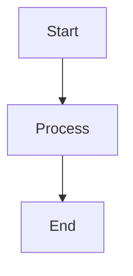
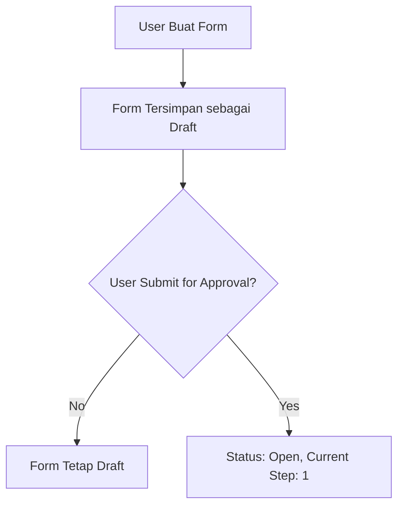

# Test Mermaid Diagram

## Simple Flow

```mermaid
flowchart TD
    A[Start] --> B[Process]
    B --> C[End]
```

## More Complex Flow

```mermaid
flowchart TD
    A[User Buat Form] --> B[Form Tersimpan sebagai Draft]
    B --> C{User Submit for Approval?}
    C -->|No| D[Form Tetap Draft]
    C -->|Yes| E[Status: Open, Current Step: 1]
```
